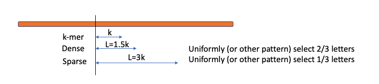
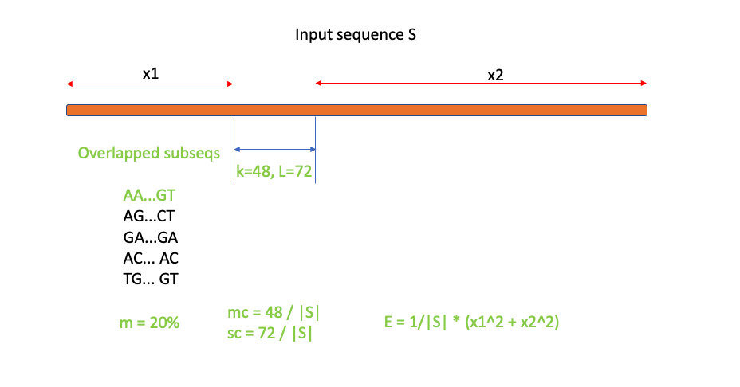

## Information

Code: [Github folder](https://github.com/ShaopengLiu1/Koslicki_lab_metagenomic_analysis/tree/main/20220905_strobemer_truncation_simulation)

Result: raw data in PSU Onedrive folder

Goal: use simulated data to check if we can apply the k-mer truncation idea to strobemer.

#### Contents:

- [Results & Conclusion](#conclusion)
- [Analysis note](#note)
- [Parameter and coding details](#code)
  - Illustration of k-mer, spaced-kmer (sparse/dense)
  - Illustration of minstrobe, randstrobe, and hybridstrobe
  - Permalink to key setps
- [Evaluation matrix](#eval)
  - Illustration of m, sc, mc and E
- [Manual validation result](#validate)

---

### Results and conclusion: 

Results: See the excel file.

Conclusion:

1. single-strobe level truncation doesn't work. This is NOT due to mutation, but due to the nature of stobermer as the selection algorithm will shift when strobe length changes. (also see "Validation section")
2. the regular k=30 analysis is comparable with the paper, and can be used as a vaildation.
3. it's expected the higher mutation rate will disturb the performance. 5% seems like to be acceptable in analysis.

---

### Working notes for data processing 

1. this random genome contains only ACGT (but we may need to exclude "nN" for other consensus sequences)
2. mutation model:
   1. each nucleotide (nt) has equal probability of being mutated
   2. if mutated, each nt has equal probability of being insertion/deletion/substitution
3. for efficiency, the input sequences is trimed down to 10000nt
4. a uniform selection pattern is used for spaced-kmers, though this pattern can be arbitrary
5. we don't need reverse_complement in this simulation

---

### Parameter and coding details 

| **Parameters** | **Our** **setting** | **Strobemer** **paper** |
| -------------- | ------------------- | ----------------------- |
| kmer size      | 24-48-6             | 30                      |
| mutation ratio | [1%,  3%, 5%, 10%]  | [1%,  5%, 10%]          |
| strobe size    | 16, 24              | 10, 15                  |
| window_min     | 25                  | 25                      |
| window_max     | 50                  | 50                      |
| replicate      | 10                  | ?                       |

Consideration for parameters:

1. Pick max strobe size 24 because it can't be larger than the minimum window size, o.w. the window pattern will change during truncation
2. There is no dup (or negligible probability) during truncation for a short seq

#### Illustration of 6 types of k-mers

K-mer and Spaced-kmer

1. k-mer: consecutive string of length k
2. Spaced-kmer: select k letters out of a longer consecutive region L 
   1. Dense: k letters from L=1.5k region (2/3)
   2. Sparse: k letters from L=3k region (1/3)
   3. Selection **pattern is arbitrary**, I use uniform for convenience

Strobemers (pseudocode available in paper):

1. the **window pattern is FIXED** when the starting point i is selected:
   1. first window $W_1$ in $[i+w_{min}\;,\;i+w_{max}]$
   2. all following windows $W_j\;(j\geq2)$ are in distance of $w_{max}$ from the previous window
2. Use 3 different algorithms to select the next strobe within each window
   1. minstrobe: minimizer of current strobe
   2. randstrobe: minimizer of (last strobe + current strobe)
   3. hybridstrobe: pick a subset region from the window based on last strobe, and then minimizer of current strobe

#### Key steps and codes:

1. [Uniform random mutation for input sequence](https://github.com/ShaopengLiu1/Koslicki_lab_metagenomic_analysis/blob/36e3225748a0852013513ba72762c413b2beeeea/20220905_strobemer_truncation_simulation/draft_code.py#L51)
2. [Generate 6 types of k-mers and strobemers](https://github.com/ShaopengLiu1/Koslicki_lab_metagenomic_analysis/blob/36e3225748a0852013513ba72762c413b2beeeea/20220905_strobemer_truncation_simulation/draft_code.py#L341)
3. [Strobemer construnction](https://github.com/ShaopengLiu1/Koslicki_lab_metagenomic_analysis/blob/36e3225748a0852013513ba72762c413b2beeeea/20220905_strobemer_truncation_simulation/draft_code.py#L112)
   1. Based on the pseudo code provided by the author
   2. With one modification only: add a stop check when the sequence tail is not long enough 
4. [Evaluation matrix](https://github.com/ShaopengLiu1/Koslicki_lab_metagenomic_analysis/blob/36e3225748a0852013513ba72762c413b2beeeea/20220905_strobemer_truncation_simulation/draft_code.py#L394)
5. [Truncate all 6 types of kmers](https://github.com/ShaopengLiu1/Koslicki_lab_metagenomic_analysis/blob/36e3225748a0852013513ba72762c413b2beeeea/20220905_strobemer_truncation_simulation/draft_code.py#L283)

6. [Workflow for output tables](https://github.com/ShaopengLiu1/Koslicki_lab_metagenomic_analysis/blob/36e3225748a0852013513ba72762c413b2beeeea/20220905_strobemer_truncation_simulation/draft_code.py#L480)
   1. for given list of mutated strings, mutation rate, strobe number and k value
   2. repeat the analysis for 10 times and get the average evaluation matrix

---

### Evaluation matrix 

Subseq: k-mers or strobemers

| Term | Information          | Measurement                                                  |
| ---- | -------------------- | ------------------------------------------------------------ |
| m    | % of subseq matches  | number of matched subseqs / total subseqs                    |
| sc   | sequence coverage    | union of regions covered by subseqs' EXACT nt location       |
| mc   | match coverage       | union of regions spanned by whole subsets' region            |
| E    | expected island size | $E = \frac{1}{S}*\sum\limits_{\substack{x\in X}} x^2$, where X is the island set (uncovered regions) |

**（mc and sc labels should be exchanged)**

---

### Manual validation 

[Code](https://github.com/ShaopengLiu1/Koslicki_lab_metagenomic_analysis/blob/36e3225748a0852013513ba72762c413b2beeeea/20220905_strobemer_truncation_simulation/draft_code.py#L652)

Brief results:

1. Validate for truncation process: truncation process does generate expected strobemers (truncate each strobe)
2. even for unmutated sequence itself, the truncated strobemer has poor overlap

        kmer  spaced_sparse  spaced_dense   minstrobe  randstrobe  hybridstrobe

0  99.939753      99.817722     99.909439    4.257456    3.946179      3.785521
1  99.940000      99.800000     99.900000   20.000000   80.290000     78.700000
2  99.940000      99.820000     99.910000   23.170000   90.760000     88.600000
3   0.000000       0.000000      0.000000  352.000000    4.000000      6.000000

3. the situation is even worse then mutation happens

       kmer  spaced_sparse  spaced_dense   minstrobe  randstrobe  hybridstrobe

   0  72.048629      42.466309     63.380991    3.375867    2.953883      2.682608
   1  95.777466      76.395838     94.406644   17.790674   66.009606     63.037823
   2  95.777466      82.119272     95.427256   20.972584   78.106864     75.545327
   3   2.000000      42.000000      2.000000  373.000000   15.000000     20.000000
