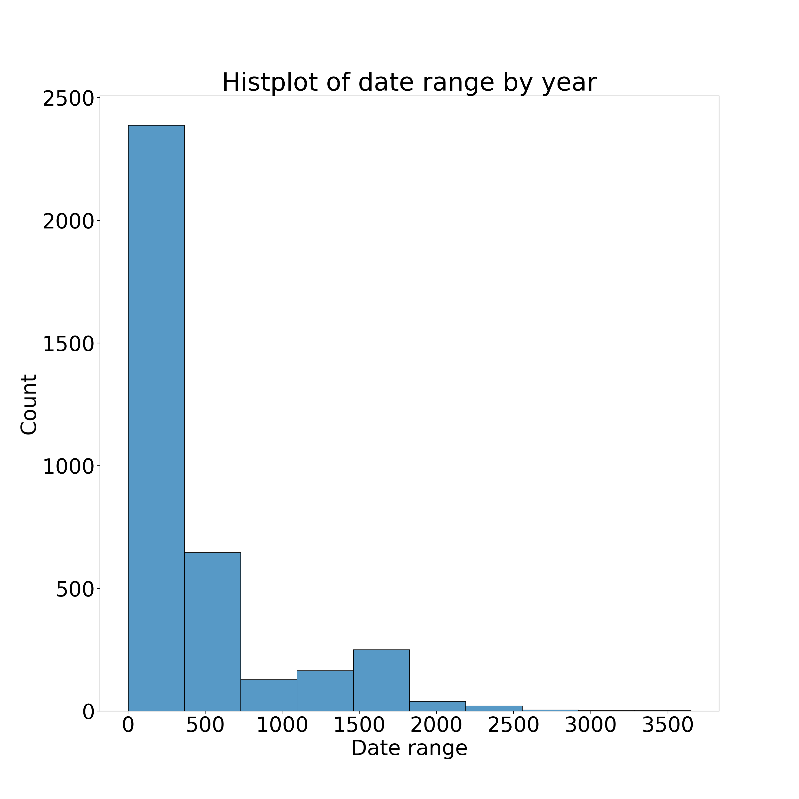

# Assembly comparison for old and new data

Shaopeng Liu (sml6467@psu.edu)

05/25/2021

Local files: 

```bash
/data/sml6467/github/Koslicki_lab_metagenomic_analysis/3_mini_analysis/20210525_Assembly_exploration
```

---

### Table of contents

- [1. Data filter](#1_filter)
- [2. Search for pairs](#2_pair)
- [3. Demo: locate data for a selected pair](#3_data)
- [4. Data prep](#4_data)
- [5. Results collection](#5_collect)


---

### Step1: data filter <a name="1_filter"></a> 

1.1 Download ref file

```bash
# metadata
wget -q -O NCBI_GenBank_bacteria_assembly_summary.txt  ftp://ftp.ncbi.nlm.nih.gov/genomes/genbank/bacteria/assembly_summary.txt
# documents for metadata
wget -q ftp://ftp.ncbi.nlm.nih.gov/genomes/README_assembly_summary.txt
```


1.2 Quality filter

- Col11: "Version status": "latest" (the most recent of all the versions for this assembly chain)
- Col14: "genome_rep": "Full" (the data used to generate the assembly was obtained from the whole genome, as in Whole Genome Shotgun (WGS) assemblies for example. There may still be gaps in the assembly.)

```bash
# interestingly, the metadata ONLY has "latest" records......
#while "latest" refers to an assembly chain
# if you get sth here, that means it's a new assembly chain for the same species
cut -f 11 NCBI_GenBank_bacteria_assembly_summary.txt | sort | uniq -c
################################
 967224 latest
      1 #   See ftp://ftp.ncbi.nlm.nih.gov/genomes/README_assembly_summary.txt for a description of the columns in this file.
      1 version_status
################################

awk -F '\t'  '{if($14=="Full" && $11=="latest") print $0}' NCBI_GenBank_bacteria_assembly_summary.txt > filtered_metadata.txt
```


1.3 Use "contig" only because scaffolding is another (big) computational challenge

- Col12: "assembly_level": "Contig"

```bash
# get some distribution infor
cut -f 12 filtered_metadata.txt | sort | uniq -c

################################
   4881 Chromosome
  25551 Complete Genome
 798307 Contig
 138278 Scaffold
################################

# keep only contig data
awk -F '\t'  '{if($12=="Contig") print $0}' filtered_metadata.txt > contig_only_filtered_metadata.txt  
```


---

### Step2.1: search for species-level old/new pairs <a name="2_pair"></a> 

2.1.1 Species-level pairs (just in case)

- Col7: "species_taxid"

```bash
cut -f 7 contig_only_filtered_metadata.txt | sort | uniq -c | awk '$1>1' > species_level_hits.txt
wc -l species_level_hits.txt   # 5023 -> because there are less species
```


2.1.2 Check time-span

- Col 15: "seq_rel_date"

```bash
# originally set for 2 purposes, but then found that I can't direct search strain in this way
function get_date_range() {
  search_key=$1 #strain name OR species id for 2 levels
  match_col=$2 #strain name: col9, taxid: col7
  #echo "searching $search_key"
  awk -F "\t" -v input_key="$search_key" -v input_col="$match_col" '$input_col==input_key' contig_only_filtered_metadata.txt | cut -f 15 > _temp.txt
  # write into sec since 1970-1-1
  echo -n ""  > _time.txt
  for time_tag in $(cat _temp.txt); do
    date -d $time_tag "+%s" >> _time.txt
  done
  # get time range
  sort -k1,1n _time.txt  > _range.txt
  start=$(head -1 _range.txt)
  end=$(tail -1 _range.txt)
  range=$(echo "scale=1;($end - $start)/3600/24" | bc)  # round to day
  # return range value
  rm _time.txt _range.txt _temp.txt
  echo $range
}

# test function
awk '$7==100371' contig_only_filtered_metadata.txt | cut -f 15  # 16 records, date range: 2019.3.1-2020.7.20
get_date_range 100371 7  # 507 days
aa=$(get_date_range 100371 7)
echo $aa  # 507

# get date range for species data
echo "" > date_range_species.txt
for taxid in $(awk '{print $2}' species_level_hits.txt); do
  echo processing $taxid
  date_range=$(get_date_range "$taxid" 7)
  echo -e "$taxid\t$date_range" >> date_range_species.txt
done
```


### Step2.2: search for strain-level old/new pairs

2.2.1 Re-format the metadata for better search

- Col9: Infraspecific name: the strain, breed, cultivar or ecotype of the organism from which the sequences in the genome assembly were derived.
- Because 1 strain name can be shared by many species, e.g. strain=1. Need to paste species name and strain together to remove (many) false positive
- col1 is GCA identifier, col7 is taxid, col8 is sci name, col9 is strain name, col15 is release date

```bash
awk -F"\t" '$9' contig_only_filtered_metadata.txt | awk -F"\t" '{print $1"\t"$7"\t"$8" "$9"\t"$15}' > merge_strain_name_contig_only_filtered_metadata.txt
```


2.2.2 Strain-level pairs (ideal situation)

- Count unique on merged name+strain

```bash

cut -f 3 merge_strain_name_contig_only_filtered_metadata.txt | sort | uniq -c | awk '$1>1' | sed '1d' > strain_level_hits.txt
wc -l strain_level_hits.txt    # 3741 -> pretty much
```

- get date range

```bash
# tune the grep function
function get_strain_date_range() {
  search_key=$1 #strain name OR species id for 2 levels
  awk -F "\t" -v input_key="$search_key" '$3==input_key' merge_strain_name_contig_only_filtered_metadata.txt | cut -f 4 > _temp.txt
  # write into sec since 1970-1-1
  echo -n ""  > _time.txt
  for time_tag in $(cat _temp.txt); do
    date -d $time_tag "+%s" >> _time.txt
  done
  # get time range
  sort -k1,1n _time.txt  > _range.txt
  start=$(head -1 _range.txt)
  end=$(tail -1 _range.txt)
  range=$(echo "scale=1;($end - $start)/3600/24" | bc)  # round to day
  # return range value
  rm _time.txt _range.txt _temp.txt
  echo $range
}

# test function
grep -w "Acidovorax caeni strain=R-24608" merge_strain_name_contig_only_filtered_metadata.txt
get_strain_date_range "Acidovorax caeni strain=R-24608"  #415


### due to some space in the strain names, need to print all but $1, e.g. "ecotype=Quinolone resistant". This can't be properly handled by awk '{for(i=2,i<=NF,i++)}' OR cut -d" " -f 8-. 
### Notice all first 8 characters are not needed, so sed is the easiest solution
sed 's/^........//' strain_level_hits.txt > _temp_strain_name.txt
echo "" > date_range_strain.txt
while read strain_name; do
  echo processing $strain_name
  date_range=$(get_strain_date_range  "$strain_name")
  echo -e "$strain_name\t$date_range" >> date_range_strain.txt
done  < _temp_strain_name.txt
```


### Step2.3 Summary stats for available data

2.3.1 clean results

```bash
rm _temp_strain_name.txt 

sed '1d' date_range_species.txt | sort -k2,2rn  > _temp && mv _temp date_range_species.txt
sed '1d' date_range_strain.txt  | sort -t$'\t' -k2,2rn  > _temp && mv _temp date_range_strain.txt
```


2.3.2 summary stats

```python
# py script
import os
import pandas as pd
import seaborn as sb
from matplotlib import pyplot as plt
import math

#local dir
#os.chdir("/Users/shaopeng/Desktop/assembly_mini")

# read table and round up (cause bash is just trunc)
f_strain = pd.read_table("date_range_strain.txt", header=0)
f_strain.columns=['name', 'range']
f_species = pd.read_table("date_range_species.txt", header=None)
f_species.columns=['name', 'range']
f_species['range'] = f_species['range'].fillna(0)

# get date ranges
l1=list(f_strain['range'])
l_strain = [int(math.ceil(x)) for x in l1]
l2=list(f_species['range'])
l_species = [int(math.ceil(x)) for x in l2]

# plot
def plot_range_distribution(input_list, out_name="test"):
	min_v = min(input_list)
	max_v = max(input_list)
	print("Min is "+str(min_v))
	print("Max is "+str(max_v))
	plot_bins = list(range(min_v, max_v, 365))
	fig, axs = plt.subplots(1, 1, figsize=(16, 16))
	plt.rcParams.update({'font.size': 30})
	sb.histplot(input_list, ax=axs, bins=plot_bins, fill=True)
	axs.title.set_text("Histplot of date range by year")
	#axs.set_ylim([0, 1000])
	axs.set(ylabel="Count", xlabel="Date range")
	fig.savefig("Date_range_distri_" + out_name + ".png", dpi=200)
	plt.close(fig)
	
plot_range_distribution(l_species, "species")
plot_range_distribution(l_strain, "strain")
```


#### Date range distribution for strain-level pairs (bin size: 1 year).

- a significant portion of strains have data entries that span more than 1 year




---

### Step3. Locate data for a given pair <a name="3_data"></a> 

3.1 locate data

```bash
target="Staphylococcus aureus strain=A69"  # use this as an example
grep "$target" merge_strain_name_contig_only_filtered_metadata.txt | sort -t$'\t' -k4,4rV  
# Output:
# GCA_903804755.1	1280	Staphylococcus aureus strain=A69	2020/06/15
# GCA_000698045.1	1280	Staphylococcus aureus strain=A69	2014/06/04
```


3.2 Use the GCA identifier to find raw data

Search from the [NCBI Assembly database](https://www.ncbi.nlm.nih.gov/assembly/).


3.2.1 NCBI FTP only contains the assemblied data

The [FTP link](ftp://ftp.ncbi.nlm.nih.gov/genomes/all/GCA/903/804/755/GCA_903804755.1_21673_5_85) contains processed data based on the Readme file. 

We can find the assembly stats here, but not sure if we need it.


3.2.2 Find the raw data

Raw data

- Search GCA: https://www.ncbi.nlm.nih.gov/assembly/GCA_010429105.1/
- Go to Biosample: https://www.ncbi.nlm.nih.gov/biosample/SAMN01823741/
- SRA: https://www.ncbi.nlm.nih.gov/sra/?term=SRS510247

Assembler: skip those without assmbler infor (not in NCBI or can't find in publication)

```
# target="Salmonella enterica subsp. enterica serovar Rissen str. 150 strain=150"
# GCA_010429105.1	28901	Salmonella enterica subsp. enterica serovar Rissen str. 150 strain=150	2020/02/11
# GCA_000335835.1	28901	Salmonella enterica subsp. enterica serovar Rissen str. 150 strain=150	2013/02/01

# new: SKESA v. 2.2 (bingo)
# old: Newbler v. 2.3   (https://www.biostars.org/p/260053/) not live anymore, need to contact Roche for a copy
```


3.3.3 Notes before the analysis:

- time span: crossing different years.

- fix old/new assemblers? Or be consistent with data?
  - old assembly on old data: download the uploaded files  (assembled fna.gz)
  - pick some state-of-art (currently the best)
  - Reach to Paul (Shiki?)  http://rayan.chikhi.name/


---

### Step4. Data preparation <a name="4_data"></a> 

4.1 Pick several data with time span within 1~7 years from "date_range_strain.txt" file:

| Strain                                                       | Last update | Range/yr | Newest data                                                  | Assembler         | Oldest data                                                  | Assembler          | Note |
| ------------------------------------------------------------ | ----------- | -------- | ------------------------------------------------------------ | ----------------- | ------------------------------------------------------------ | ------------------ | ---- |
| (No: miss old sra)<br />Escherichia coli strain=G5           | 2021/04/16  | 6.5      | [GCA_018044965.1](https://www.ncbi.nlm.nih.gov/assembly/GCA_018044965.1/) | SKESA v. 2.2      | [GCA_000768485.1](https://www.ncbi.nlm.nih.gov/assembly/GCF_000768485.1/) | Velvet v. 1.2.10   |      |
| (No: Pacbio for new)<br />Aliivibrio fischeri strain=KB2B1   | 2021/04/13  | 4.9      | [GCA_017921855.1](https://www.ncbi.nlm.nih.gov/assembly/GCF_017921855.1/) | HGAP v. 2019      | [GCA_001640305.1](https://www.ncbi.nlm.nih.gov/assembly/GCF_001640305.1/) | CLC NGS Cell v. 6  |      |
| (No: miss old SRA)<br />Staphylococcus haemolyticus strain=IIF2SW-P5 | 2020/08/22  | 3.9      | [GCA_014266945.1](https://www.ncbi.nlm.nih.gov/assembly/GCF_014266945.1/) | SPAdes v. v3.11.1 | [GCA_001743425.1](https://www.ncbi.nlm.nih.gov/assembly/GCF_001743425.1/) | A5 v. 20150522     |      |
| (No: miss both SRA)<br />Klebsiella pneumoniae strain=70     | 2020/09/11  | 2.9      | [GCA_014526145.1](https://www.ncbi.nlm.nih.gov/assembly/GCF_014526145.1/) | SPAdes v. 3.9.0   | [GCA_002411925.1](https://www.ncbi.nlm.nih.gov/assembly/GCF_002411925.1/) | SPAdes v. 3.9.1    |      |
| (No: miss both SRA) <br />Listeria monocytogenes strain=LM11 | 2019/12/29  | 2.2      | [GCA_009807375.1](https://www.ncbi.nlm.nih.gov/assembly/GCF_009807375.1/) | SPAdes v. 3.10    | [GCA_002776275.1](https://www.ncbi.nlm.nih.gov/assembly/GCF_002776275.1/) | SPAdes v. v3.9.0   |      |
| (No: miss both SRA) <br />Escherichia coli strain=C127       | 2020/05/11  | 1.5      | [GCA_013030815.1](https://www.ncbi.nlm.nih.gov/assembly/GCF_013030815.1/) | SPAdes v. 3.12    | [GCA_003721935.1](https://www.ncbi.nlm.nih.gov/assembly/GCF_003721935.1/) | SPAdes v. 3.12.0   |      |
| (No: miss both SRA)<br />Clostridium perfringens strain=2C45 | 2020/12/21  | 0.5      | [GCA_016236225.1](https://www.ncbi.nlm.nih.gov/assembly/GCF_016236225.1/) | SPAdes v. 3.9.0   | [GCA_013305215.1](https://www.ncbi.nlm.nih.gov/assembly/GCF_013305215.1/) | unicycler v. 0.4.8 |      |
| (No: miss both SRA)<br />Streptomyces somaliensis DSM 40738 strain=DSM 40738 |             |          |                                                              |                   |                                                              |                    |      |
| (No: miss both SRA)<br />Bartonella doshiae strain=BM1374167 |             |          |                                                              |                   |                                                              |                    |      |
| (No: miss both SRA)<br />Escherichia coli strain=EC1         |             |          |                                                              |                   |                                                              |                    |      |
| (No: miss both SRA) Staphylococcus aureus strain=A69         |             |          |                                                              |                   |                                                              |                    |      |
| Acinetobacter baumannii strain=MRSN15038                     |             |          |                                                              |                   |                                                              |                    |      |


Complete-available list:

**!!! Note:** 

1. date range in assembly record may NOT reflect true seq data range (usualy shorter)
2. source varies a lot, collection date -> publish date varies a lot
3. Some interesting finding: 2 assemblies from the same data (might support your idea):
   1. GCA_902156795.1, GCA_900501565.1
   2. GCA_902156825.1, GCA_900509495.1
4. New assembly may based on older data (5th and 6th record)
5. Make an introduction slide?
   1. our method
   2. 
6. Other databases for future usage: EBI, IMG/r, BGI, JGI
7. check ref OR ref-free based on Quast
   1. gene finding using gene mark
   2. provide raw seq data
   3. 

| Strain                                           | Day range | Publish time            | New                                                    | Old                                                    | ShortCut                |
| ------------------------------------------------ | --------- | ----------------------- | ------------------------------------------------------ | ------------------------------------------------------ | ----------------------- |
| Acinetobacter baumannii strain=MRSN15038         | 120       | 2015-11-14 ~ 2016-3-13  | https://www.ncbi.nlm.nih.gov/assembly/GCA_016527325.2  | https://www.ncbi.nlm.nih.gov/assembly/GCF_001441545.1/ | S1                      |
| Escherichia coli strain=C305                     | 732       | 2019-04-04 ~ 2021-04-05 | https://www.ncbi.nlm.nih.gov/assembly/GCA_018072745.1/ | https://www.ncbi.nlm.nih.gov/assembly/GCF_004769025.1/ | S2                      |
| Staphylococcus aureus strain=17                  | 834       | 2019-04-18 ~ 2021-07-30 | https://www.ncbi.nlm.nih.gov/assembly/GCF_010364655.1/ | https://www.ncbi.nlm.nih.gov/assembly/GCF_005146215.2/ | S3                      |
| Campylobacter jejuni strain=PNUSAC009032         | 362       | 2019-05-23 ~ 2020-05-19 | https://www.ncbi.nlm.nih.gov/assembly/GCA_013132495.1/ | https://www.ncbi.nlm.nih.gov/assembly/GCA_005872375.1/ | S4                      |
| Escherichia coli strain=28                       | 111       | 2012-04-15 ~ 2012-08-04 | https://www.ncbi.nlm.nih.gov/assembly/GCA_017761325.1/ | https://www.ncbi.nlm.nih.gov/assembly/GCA_012533515.1/ | S5 (deleted, 2 in 2012) |
| Salmonella enterica strain=PNUSAS029866          | 44        | 2017-12-13 ~ 2018-01-26 | https://www.ncbi.nlm.nih.gov/assembly/GCA_016358905.1/ | https://www.ncbi.nlm.nih.gov/assembly/GCA_010178345.1/ | S6                      |
| Vibrio cholerae strain=O1 Inaba El Tor           | 0         | 2016-10-24 ~ 2016-10-24 | https://www.ncbi.nlm.nih.gov/assembly/GCA_018073345.1/ | https://www.ncbi.nlm.nih.gov/assembly/GCA_015746525.1/ | S7                      |
| Listeria monocytogenes strain=FDA1077798-012-001 | 10        | 2018-10-21 ~ 2018-10-30 | https://www.ncbi.nlm.nih.gov/assembly/GCA_004472675.1/ | https://www.ncbi.nlm.nih.gov/assembly/GCA_003777485.1/ | S8                      |


To find the corresponding files:

```
### code example:
target="Escherichia coli strain=A3"
grep -w "$target" merge_strain_name_contig_only_filtered_metadata.txt | sort -t$'\t' -k4,4rV  

```


Download list:

```bash
function download_files {
  echo "Downloading $1"
  fastq-dump.2.11.0 --split-3 $1
  rename.ul -v $1 $2 *fastq
}

# download list
SRR3223466	S1_New_2016-03-13
SRR2911725	S1_Old_2015-11-14
DRR150423	S2_New_2021-04-05
SRR6952372	S2_Old_2019-04-04
SRR14923836	S3_New_2021-07-30
SRR8925280	S3_Old_2019-04-18
SRR11813656	S4_New_2020-05-19
SRR9108111	S4_Old_2019-05-23
SRR6514409	S6_New_2018-01-26
SRR6373416	S6_Old_2017-12-13
SRR4432995	S7_New_2016-10-24
SRR4432997	S7_Old_2016-10-24
SRR8134478	S8_New_2018-10-30
SRR8082407	S8_Old_2018-10-21
```


4.2 Assemblers:

1. All found data were processed by SKESA and Spades (Except 1 by Newbler, which is a commercial software and no longer available now). Year 2018~2021, except 1 in 2016
2. Refs:
   1. Megahit:
      1. https://github.com/Penn-State-Microbiome-Center/KickStart-Workshop-2021/blob/main/Day5-Shotgun/MEGAHIT.md
      2. https://github.com/voutcn/megahit
      3. https://anaconda.org/bioconda/megahit/labels
   2. SKESA:
      1. https://anaconda.org/bioconda/skesa/files?version=2.1
   3. SPAdes:
      1. https://github.com/ablab/spades
      2. https://anaconda.org/bioconda/spades/files?version=3.7.0

| Name           | Category | Version        | Git  | Conda | Note         |
| -------------- | -------- | -------------- | ---- | ----- | ------------ |
| Megahit (2015) | Old      | 1.0.3 @2015.10 |      | Y     |              |
| Megahit (2015) | New      | 1.2.9 @2019.10 |      | Y     |              |
| SKESA (2018)   | New      | 2.4.0 @2020.3  |      | Y     |              |
| SKESA (2018)   | Old      | 2.1.0 @2018.2  |      | Y     |              |
| SPAdes (2012)  | New      | 3.15.3 @2021.7 |      | Y     | Many verions |
| SPAdes(2012)   | Old      | 3.7.0 @2016.3  |      | Y     |              |


2 temp env for old vs new assemblers

```bash
conda create -y -n old_assmb_py35 python=3.5
conda activate old_assmb_py35
conda install -y -c bioconda megahit=1.0.3
conda install -y -c bioconda skesa=2.1
conda install -y -c bioconda spades=3.7.0


conda create -y -n new_assmb_py37 python=3.7
conda activate new_assmb_py37
conda install -y -c bioconda megahit=1.2.9
conda install -y -c bioconda skesa=2.4.0
conda install -y -c bioconda spades=3.15.3
```


4.3 Process all data by default setting

1. Method improvement: New assembler on old data vs old assembler on old data
2. Data improvement: New assembler on new data  vs new assembler on old data
3. Use 2*3 assemblers to process the 7 pairs

```bash
#cd to the input data folder
#New version loop:
conda activate new_assmb_py37
for prefix in $(cut -f 2 raw_data.txt); do
	echo $prefix
	# megahit
	megahit -1 ${prefix}_1.fastq -2 ${prefix}_2.fastq -o ../assembly_out/M2015_New_${prefix}
	# SKESA
	skesa --reads ${prefix}_1.fastq,${prefix}_2.fastq --cores 4 --memory 48 > ../assembly_out/S2018_New_${prefix}.fa
	# SPAdes
	spades.py -1 ${prefix}_1.fastq -2 ${prefix}_2.fastq -o ../assembly_out/SPA2012_New_${prefix}
done

# Old version loop
conda activate old_assmb_py35
for prefix in $(cut -f 2 raw_data.txt); do
	echo $prefix
	# megahit
	megahit -1 ${prefix}_1.fastq -2 ${prefix}_2.fastq -o ../assembly_out/M2015_Old_${prefix}
	# SKESA
	skesa --fastq ${prefix}_1.fastq,${prefix}_2.fastq --cores 4 --memory 48 > ../assembly_out/S2018_Old_${prefix}.fa
	# SPAdes
	spades.py -1 ${prefix}_1.fastq -2 ${prefix}_2.fastq -o ../assembly_out/SPA2012_Old_${prefix}
done
```


Megahit

```bash
# New v1.2.9
megahit -1 ${prefix}_1.fastq -2 ${prefix}_2.fastq -o ../assembly_out/M2015_New_${prefix}

# Old v1.0.3
megahit -1 ${prefix}_1.fastq -2 ${prefix}_2.fastq -o ../assembly_out/M2015_Old_${prefix}
```


SKESA

```bash
# New v2.4
skesa --reads ${prefix}_1.fastq,${prefix}_2.fastq --cores 4 --memory 48 > ../assembly_out/S2018_New_${prefix}.fa

# Old v2.1  
skesa --fastq ${prefix}_1.fastq,${prefix}_2.fastq --cores 4 --memory 48 > ../assembly_out/S2018_Old_${prefix}.fa
```


SPAdes

```bash
# New 3.15.3
spades.py -1 ${prefix}_1.fastq -2 ${prefix}_2.fastq -o ../assembly_out/SPA2012_New_${prefix}

# Old 3.7
spades.py -1 ${prefix}_1.fastq -2 ${prefix}_2.fastq -o ../assembly_out/SPA2012_Old_${prefix}


```


4.4 Quast comparison

```bash
#cd to output folder, use my own metagenomic env
quast -o lsp  -m 250 --circos --glimmer --rna-finding -1 ../../assembly_input_data/S3_Old_2019-04-18_1.fastq  -2 ../../assembly_input_data/S3_Old_2019-04-18_2.fastq S2018_New_S3_Old_2019-04-18.fa
```


```bash
#cd to the input folder
conda activate metagenomic_py37

### SKEDA only has 1 fa out
### put into a shell
for suffix in $(cut -f 2 raw_data.txt); do
	echo "Processing $suffix"
	for version in New Old; do
		echo "Processing S2018_${version}_${suffix}"
		quast -o ../quast_out/S2018_${version}_${suffix} -m 250 --circos --glimmer --rna-finding -1 ${suffix}_1.fastq -2 ${suffix}_2.fastq ../assembly_out/S2018_${version}_${suffix}.fa
	done
done


### SPAdes
### put into a shell
for suffix in $(cut -f 2 raw_data.txt); do
	echo "Processing $suffix"
	for version in New Old; do
		echo "Processing SPA2012_${version}_${suffix}"
		quast -o ../quast_out/SPA2012_${version}_${suffix} -m 250 --circos --glimmer --rna-finding -1 ${suffix}_1.fastq -2 ${suffix}_2.fastq ../assembly_out/SPA2012_${version}_${suffix}/contigs.fasta
	done
done
	


### Megahit
### put into a shell
for suffix in $(cut -f 2 raw_data.txt); do
	echo "Processing $suffix"
	for version in New Old; do
		echo "Processing M2015_${version}_${suffix}"
		quast -o ../quast_out/M2015_${version}_${suffix} -m 250 --circos --glimmer --rna-finding -1 ${suffix}_1.fastq -2 ${suffix}_2.fastq ../assembly_out/M2015_${version}_${suffix}/final.contigs.fa
	done
done
```


### 5. Results collection <a name="5_collect"></a> 

Merge all data together

```bash
cd /data/sml6467/github/Koslicki_lab_metagenomic_analysis/3_mini_analysis/20210525_Assembly_exploration/quast_out

find . -name "report.tsv" | head -1 | xargs cut -f 1 > merged_Quast_report.tsv

for folder in $(ls -d */); do
	echo $folder
	name=$(echo ${folder%/})
	cat <(echo ${name})  <(cut -f 2 ${folder}/report.tsv | sed '1d') > _temp_data.txt
	paste merged_Quast_report.tsv _temp_data.txt > _temp_merge && rm _temp_data.txt
	mv _temp_merge merged_Quast_report.tsv
done
```


Temp compare by R code

```R
quast <- read.csv("merged_Quast_report.tsv", sep="\t")
row.names(quast) <- quast[,1]
quast <- quast[,-1]
col_quast <- colnames(quast)

# def subset df function
get_subdf <- function(key_word, out_name="temp.tsv") {
  out_logic <- grepl(key_word, col_quast)
  out_df <- quast[,out_logic]
  write.table(out_df, file=out_name, sep="\t", quote=FALSE, col.names=NA)
  return(out_df)
}

# task1: assembler-dependency (method improvement)
get_subdf("New_S3_New")
get_subdf("New_S6_New")

# task2: version-dependency
get_subdf("M2015_(New|Old)_S3_New")   # an extreme case
get_subdf("S6_New")
get_subdf("M2015_")

# task3: data-dependency (data improvement)
get_subdf("New_S7_")	# a good example of close data: very similar
get_subdf("New_S2")  # seems many false-positive due to low depth (coverage doubles)
```

